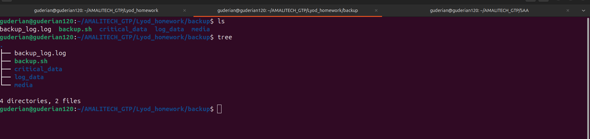
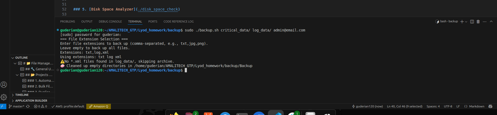
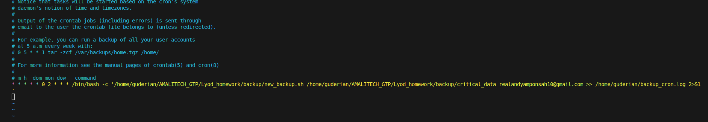
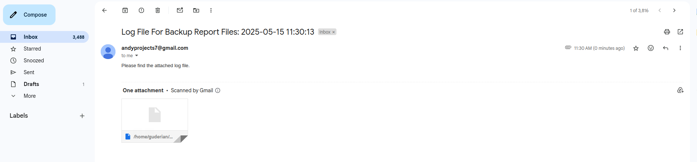

# 🗄️ Automated Backup Script

This script provides **automated backups** for selected directories with options for **file type filtering**, **logging**, and **email notifications**. It supports both **interactive** and **non-interactive** (e.g. cron job) execution.

---

## 📌 Features

* 🔧 Back up specific file types (e.g., `.txt`, `.jpg`) or all files
* 📁 Backup organized into timestamped `.tar.gz` archives per directory and file type
* 📬 Email notifications sent to the administrator on success/failure
* 🧹 Automatically deletes empty backup folders
* 🕐 Cron-compatible for automated scheduled backups
* 📜 Logs all actions to a central log file

---

## 🧪 Usage

```bash
sudo ./new_backup.sh [SOURCE_DIRECTORIES...] [ADMIN_EMAIL]
```

### ✅ Examples

```bash
sudo ./new_backup.sh /home/user/Documents /var/logs admin@example.com
```

This will:

* Ask you to specify file extensions (e.g., `txt,jpg`)
* Back up matching files from each directory
* Create `.tar.gz` archives under `Backup/`
* Log the process and send an email notification

---

## 📁 Output Structure

Backups are stored in a folder called `Backup/` in the current working directory:

```
Backup/
└── Documents/
    └── Documents_backup_2025-05-15_14-00-00_txt.tar.gz
```
## Before Script Execution
This image show the directory structure before script execution

---

## After Script Excecution

## ⚙️ Cron Job Setup


To schedule automatic backups via `cron`:

1. Edit your crontab:

   ```bash
   crontab -e
   ```

2. Add a job:

   ```bash
   0 2 * * * sudo bash -c '/path/to/new_backup.sh /path/to/dir admin@example.com >> /home/youruser/backup_cron.log 2>&1'
   ```

**Note:** The script remembers your extension choices using environment variables if configured.

---

## 🧩 Interactive Mode

When run manually, the script prompts you to enter file extensions (or press enter to back up all files).

Example prompt:

```
Enter file extensions to back up (comma-separated, e.g., txt,jpg,docx):
Extensions: txt,jpg
```

---

## 📬 Email Configuration



* The last argument must be a valid email address.
* The script uses `a custom python email server to send logs`.

Ensure you check your spam.

---

## 📓 Log File

Logs are written to:

```
./backup_log.log
```

Each entry records success/failure and backup details.

---

## ❗ Requirements

* Bash
* sudo/root privileges
* `tar`, `find`, `mail` utilities installed

---

## 🔐 Permissions

* Must be run with `sudo` to ensure access to all files and directories
* Verify write permissions to the destination directory

---

## 🧹 Cleanup

Empty backup directories are automatically deleted to keep things tidy.

