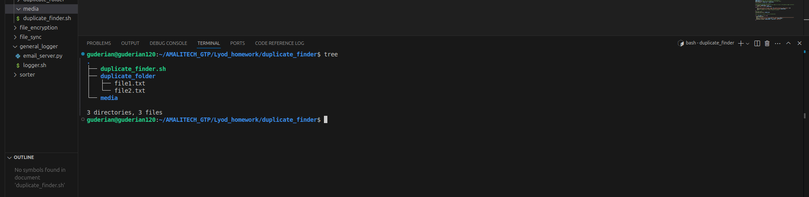
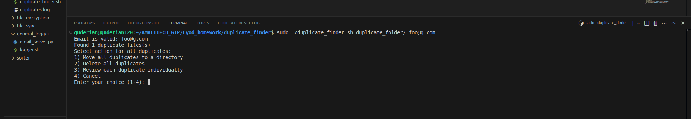

# 🧮 Duplicate File Finder (Hash-Based)

A robust Bash script that identifies and manages duplicate files using **content-based hashing** (MD5), not filenames. It offers options to **move**, **delete**, or **review** duplicates and sends an activity log via email.

---


## ✅ Why Use Hashes?

Unlike filenames, **hashes reflect actual file content**. Two files may look different (`photo1.jpg` vs `copy_photo.jpg`) but contain the same data. This script ensures **accurate detection** of true duplicates by generating unique MD5 hashes for each file.

---

## 📦 Features

* 🔍 Detects duplicates based on **MD5 hash**
* 🗂️ Offers options to **move**, **delete**, or **interactively review** duplicates
* 📧 Sends a log of actions to the admin email
* 💬 Handles spaces and special characters in filenames safely

---

## 🛠️ Usage

```bash
sudo ./duplicate_finder.sh [target_directory] [admin_email]
```

### Arguments:

* `target_directory`: Directory to scan for duplicate files
* `admin_email`: Email to receive the operation log

### Example:

```bash
sudo ./duplicate_finder.sh /home/user/downloads admin@example.com
```

---

## 🧰 Options When Duplicates Are Found

1. **Move** all duplicates to a specified directory
2. **Delete** all duplicates permanently
3. **Interactively** review and handle each duplicate manually
4. **Cancel** processing

Each action is logged and, if duplicates are found, a log file is emailed to the provided admin address.

---

## 📧 Logging & Email

* Logs are saved to `duplicates.log` in the script directory
* If duplicates are found, the log is sent to the admin email using `logger.sh` and `email_server.py`

---

## 🗃️ Project Structure

```
duplicate_finder/
├── duplicate_finder.sh
├── README.md
└── ../general_logger/
    ├── logger.sh
    └── email_server.py
```

---

## ⚠️ Requirements

* Run with `sudo` (some operations like deleting system files require root privileges)
* Bash shell (Linux/macOS)
* External logger and mail script:

  * [`logger.sh`](../general_logger/logger.sh)
  * [`email_server.py`](../general_logger/email_server.py)

---

## 📌 Notes

* **Safe for filenames with spaces or special characters**
* **Only regular files are checked** (directories, symlinks skipped)
* **Email address is validated** before proceeding

