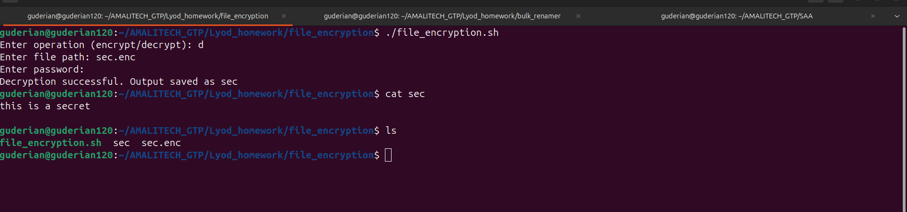

# 🔐 File Encryption & Decryption Script

This is a **simple interactive Bash script** that uses **OpenSSL AES-256-CBC** encryption to **secure or recover sensitive files**. It’s ideal for basic file-level encryption on Linux systems.

---

## ✨ Features

* 🔒 **Encrypt** any file using AES-256-CBC (military-grade encryption)
* 🔓 **Decrypt** previously encrypted `.enc` files
* 🔑 Secure **password prompt** (input hidden)
* 🧠 User-friendly interaction — prompts guide you through the process

---

## 📦 Requirements

* Linux or Unix-like system with **Bash**
* `openssl` must be installed (commonly preinstalled)

---

## 🛠️ Usage

Run the script directly:

```bash
./encryptor.sh
```

You will be interactively prompted to:

1. Choose an operation: `encrypt` or `decrypt`
2. Provide the **file path**
3. Enter a **password** (input is hidden for security)

---

## 🧪 Example

```bash
$ ./encryptor.sh
Enter operation (encrypt/decrypt): encrypt
Enter file path: secrets.txt
Enter password:
✅ File encrypted as: secrets.txt.enc
```

To decrypt:

```bash
$ ./encryptor.sh
Enter operation (encrypt/decrypt): decrypt
Enter file path: secrets.txt.enc
Enter password:
Decryption successful. Output saved as secrets.txt
```

---

## ⚠️ Warnings

* Encrypted files are saved with a `.enc` extension.
* **The password is not stored** anywhere. If you forget it, the file **cannot be recovered**.
* The script assumes the input file exists and the user has proper permissions.
* **Avoid using this on extremely large files** if performance is critical.

---

## 📁 Output

Encrypted: `file.txt → file.txt.enc`
Decrypted: `file.txt.enc → file.txt`

---

## 🙋 Support

Feel free to adapt this script to your needs (e.g., support for batch encryption, file shredding after encryption, etc.). Contributions and improvements are welcome!

---

