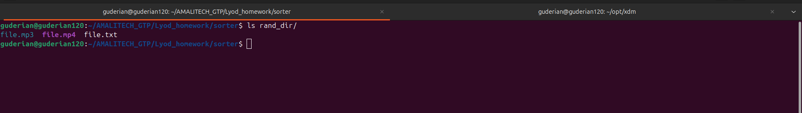
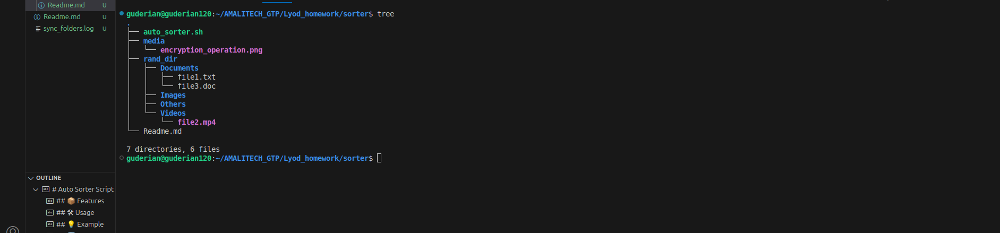

# Auto Sorter Script

This Bash script organizes files in a specified directory by moving them into subdirectories based on their file types.

## 📦 Features

- Automatically creates subfolders:
  - `Documents/` for PDF, DOC, DOCX, TXT files
  - `Images/` for JPG, JPEG, PNG, GIF files
  - `Videos/` for MP4, MOV, AVI files
  - `Others/` for all other files
- Moves files into their respective folders based on file extensions
- Supports case-insensitive file extensions

## 🛠 Usage

```bash
./auto_sorter.sh /path/to/target_directory
````

Make sure the script has executable permissions:

```bash
chmod +x auto_sorter.sh
```

## Before Script execution


## After Execution


## 💡 Example

If you run:

```bash
./auto_sorter.sh ~/Downloads
```

The script will sort files like this:

```
~/Downloads/
├── Documents/
├── Images/
├── Videos/
└── Others/
```

## 🧾 Notes

* The script only processes files directly inside the specified directory (not recursively).
* Existing folders (`Documents`, `Images`, etc.) will be reused if already present.

```

